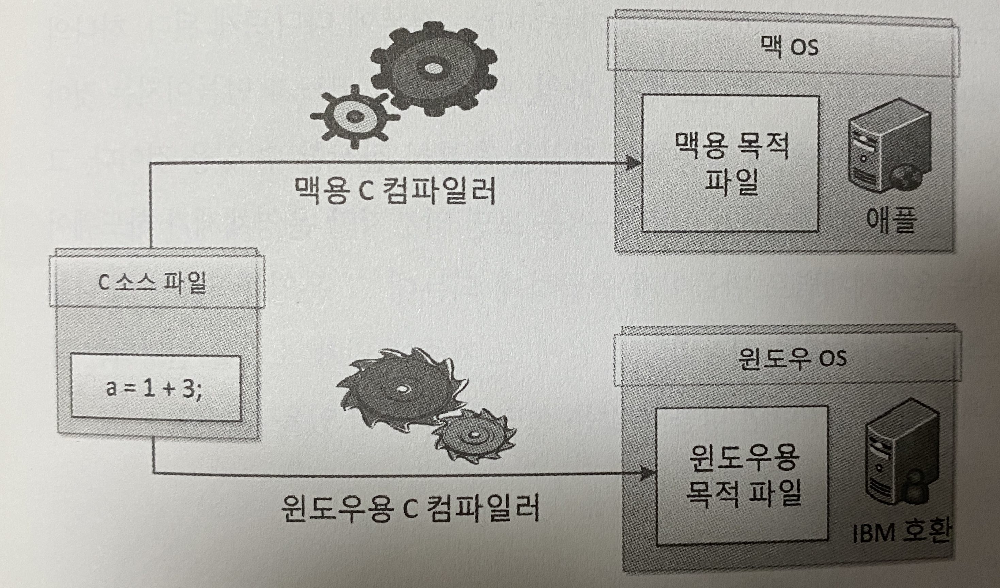

> 해당 글은 [스프링 입문을 위한 자바 객체 지향의 원리와 이해](http://www.yes24.com/product/goods/17350624)을 정리한 내용입니다.

# 목차
- [01 사람을 사랑한 기술](#01-사람을-사랑한-기술)
  - [01_신기술은 이전 기술의 어깨를 딛고](#01_신기술은-이전-기술의-어깨를-딛고)
  - [02_기계어에서 객체 지향 프로그래밍 언어로](#02_기계어에서-객체-지향-프로그래밍-언어로)
  - [03_짧은 글, 긴 생각](#03_짧은-글-긴-생각)
  - [04_책 출간의 변](#04_책-출간의-변)
- [02 자바와 절차적/구조적 프로그래밍](#02-자바와-절차적구조적-프로그래밍)
- [03 자바와 객체지향](#03-자바와-객체-지향)
- [04 자바가 확장한 객체지향](#04-자바가-확장한-객체-지향)
- [05 객체 지향 설계 5원칙 - SOLID](#05-객체-지향-설계-5원칙---solid)
- [06 스프링이 사랑한 디자인 패턴](#06-스프링이-사랑한-디자인-패턴)
- [07 스프링 삼각형과 설정 정보](#07-스프링-삼각형과-설정-정보)

# 01 사람을 사랑한 기술

## 01_신기술은 이전 기술의 어깨를 딛고
스프링은 과거로부터 현재까지의 프로그래밍 발전사에서 그 정점에 있다고 해도 과언이 아니다.  
스프링을 이해하려면 이전의 기술들을 이해하고 있어야 할까?
- SOA라고 답했는가? 잘 했다.
- CBD라고 답했는가? 매우 잘 했다.
- OOP라고 답했는가? 무척 잘 했다.
- 절차적/구조적 프로그래밍이라고 답했는가? 무진장 잘 했다.
- 설마 기계어나 어셈블리어라고 답했는가? 그랬다면 필자가 원하는 모범 답안 중에서도 만점짜리 답안이라고 할 수 있다.

정리해 보면, 스프링을 학습하려면 이렇나 이전 기술들을 마스터해야 한다는 것일까? 그건 아니다.  
이전 기술의 어깨를 딛기만 하면 된다. 이전 기술들의 의미를 빠르게 돌아보자.

## 02_기계어에서 객체 지향 프로그래밍 언어로

### 기계어 - 0과 1의 행진 / 너무나 비인간적인 언어
컴퓨터의 창세기 시절 컴퓨터가 얼마나 멍청했는지 0과 1밖에 이해하지 못했다고 한다.  
지금도 0과 1밖에는 이해하지 못한다. 컴퓨터는 바보다.  
컴퓨터는 2진법밖에 모르는 바보지만 대단히 빠르고 대단히 성실하며 대단히 정확하다.

- 당신의 컴퓨터 CPU 속도가 2GHz라면 당신의 컴퓨터는 1초당 대략 20억 번 전구 스위치를 켜거나 끌 수 있고
- 컴퓨터 메모리가 1GB라면 당신의 컴퓨터는 대략 80억 개의 전구를 한순간도 쉬지 않고 관리하는 성실함을 갖고
- 당신은 가끔 10진법 계산에서 실수하지만 컴퓨터는 2진법이기는 하지만 결코 실수하는 법이 없고 빠르고 정확하다.

기계어는 기계가 이해하는 유일한 언어로, 2진 숫자인 0과 1로만 표현된다.  
기계어 코드는 CPU에 따라 다르다. 잘 모르거나 기억이 안 나면 검색해서 기계어 특징을 한 번 살펴보자.

### 어셈블리어 - 0과 1의 행진을 벗어나 인간 지향으로 / 기계어 니모닉
어느 날 한 천재가 다음과 같은 생각을 했다고 한다.  
_"기계어의 명령들을 일상 용어로 표현하고 이걸 기계가 알 수 있는 기계어로 변역하게 되면 어떨까?"_  
그는 실제로 기계어를 일상 용어로 표현했다.  
그래서 만들어진 것이 바로 기계어 명령어와 일상 용어를 일대일로 매칭하는 코드표였다.  
바로 니모닉(Mnemonic)과 기계어의 일대일 매칭 코드표를 만든 것이다. 그 매칭 코드표를 `어셈블리`라고 불렀다.  
그런데 CPU마다 기계어가 다르기 때문에 CPU별로 각자의 `어셈블리어(Assembly Language)`도 달랐다.  
CPU마다 실행할 수 있는 기계어 세트가 달랐으니 당연히 어셈블리어도 기계어에 따라 달랐던 것이다.  
어셈블리어를 번역해 주는 소프트웨어를 `어셈블러(Assembler)`라고 한다.  

어셈블리어가 남긴 진정한 유산은
- 기계어를 벗어나 인간의 언어를 모방해 프로그램을 작성하는 것이 가능하다는 것이다.

### C언어 - 강력한 이식성 / One Source Multi Object Use Anywhere
어셈블리어라면 같은 일을 하는 프로그램의 소스 파일을 각 `기계의 종류만큼` 만들어야 했다. 멀티 소스였던 것이다.  
그런데 C 언어의 등장으로 이제는 소스파일을 단 하나만 만들면 된다. 싱글 소스다.  
하나의 소스 파일을 각 기계에 맞는 컴파일러로 컴파일만 하면 각 기계에 맞는 기계어 목적 파일이 만들어지는 것이다.

- One Source : 하나의 C 소스 파일만 작성
- Multi Object : 기종마다 하나씩 기계어 목적 파일을 생성
- Use Anywhere : 모든 컴퓨터에서 실행 가능

위의 그림을 보면 알겠지만 운영체제가 하드웨어의 특성을 추상화하고 컴파일러는 운영체제 별로 만들어져 공급하게 되는데  
그 운영체제들이 또 나름의 특성이 있었기에 하나의 소스로 각 기종별로 컴파일하기 전에  
그 기종에 맞게 소스를 변경하는 작업이 필요했다.

- short는 int 보다 크지 않은 정수
- long은 int 보다 작지 않은 정수

이러한 차이는 어떤 운영체제는 int를 2바이트로 인지하고,  
다른 어떤 운영체제는 int를 4바이트로 인지하기 때문에 발생한다.
int는 정수를 의미하는 영어 단어인 integer의 줄임말이자  
그 크기가 몇 바이트인지 규정하는 말이 아니었던 것이다.

결국 One Source Multi Object Use Anywhere는 이상향이었고  
One Source 뒤에 Fix Source, 즉 운영체제별 소스 수정 과정이 필요했던 것이다.  
그래도 어셈블리어를 하나의 기계용에서 다른 기계용으로 작성하는 수고와 노력에 비하면  
C 언어는 무척이나 편해진 것이다.
이러한 C 언어의 특성을 '이식성이 좋다'라는 말로 표현한다.  
어셈블리어 대비 이식성이 좋은 거지 자바 대비 이식성이 좋은 게 아니다.

그럼 이 부분의 교훈은 무엇일까?
- 인간이 이해하기 쉬운 언어 체계가 기계어와 1:1 매칭이 아닌 m:n 매칭이 가능해졌다는 것이다.

### 자바 - 진정한 객체 지향 언어
자바와 C#, 두 언어가 인간을 사랑한 방법은 바로 가상머신(Virtual Machine)이다.  
자바는 Write Once Use Anywhere다.
컴파일러를 기종별로 따로 구매해두지 않아도 된다는 뜻이다.  
이게 어떻게 가능한 것일까? JVM 덕분일까? JRE 덕분일까? JDK 덕분일까?  
아래 그림이 쉽게 설명해 줄 것이다.

C 언어로 작성한 소스를 다른 기종의 컴퓨터에서 실행하면 소스와 각 기종용 컴파일러를 준비해야만 했다.  
그런데 자바로 구현한 소스는 다른 기종의 컴퓨터에서 실행하기 위해 목적 파일인 오브젝트 파일만 가져가면 된다.  
물론 다른 기종의 컴퓨터에 해당 기종용 JRE가 설치돼 있어야 한다.

## 03_짧은 글, 긴 생각
### 당신은 CBD, SOA가 어려운가?
어느 날 누군가가 블록화 개발에 CBD라는 아름다운 이름을 붙였다.  
또 어느 날 누군가가 서비스 지향적인 개발에 SOA라는 이름을 붙였다.  

CBD는 Component Based Development의 약자로, 번역하면 컴포넌트 기반 개발이 된다.  
CBD는 애플리케이션을 통짜로 개발하지 말고, 애플리케이션을 의미있는 단위로 구분하고 그 단위를 하나 하나씩 부품으로  
개발해 마치 레고 블록을 쌓아 올리듯 부품을 결합해 소프트웨어 제품을 완성하자는 방법론이자 기법이다. 제품이 아니다.

SOA는 Service Oriented Architecture의 약자로, 번역하면 서비스 중심 구조 또는 의역하면 서비스 지향 구조라고 할 수 있다.  
개발자 입장에서의 개발이 아니라 실제 현실의 업무를 기준으로 개발하자는 사상이다. 제품이 아니다.

### 스프링 프레임워크는 사상이면서 또 단일 제품이다.
객체 지향을 모르고 스프링을 안다는 것은 어불성설이다. 스프링은 객체 지향의 기반 위에 굳건히 서 있기 때문이다.  
_이 책의 목표는 바로 자바라는 제품을 이용해 객체 지향을 이해하는 것이다._  
개념이 제품에 녹아 있을 테니, 역으로 제품 안에 녹아 들어 있는 개념을 찾아 이해해 보자는 것이다.  
OOP를 구현한 제품이 자바이니, OOP의 특성은 자바 코드로 나타날 것이다.  
그렇다면 자바 코드에 나타난 OOP 특성으로 인해 OOP를 더 잘 이해할 수 있을 것이다.  
필자가 생각하는 **스프링 프레임워크의 개념은 OOP 프레임워크**다.  
OOP 프레임워크라고 규정했으니 스프링 프레임워크를 이해하려면 먼저 OOP를 알아야 한다.  
더불어 프레임워크가 무엇인지 알아야 한다.  

스프링 프레임워크를 학습하기 가장 힘든 이유는 OOP 자체를 잘 모르거나 오해하고 있기 때문이다.  
스프링을 지배하는 근원적인 요소가 있는데 바로 스프링 삼각형 이라고 하는 `IoC/DI, AOP, PSA`이다.  
스프링 프레임워크의 또 다른 아름다움은 ORM, OXM, JMS, AOP, CoC 등  
엔터프라이즈 애플리케이션을 구현하는 데 필요한 거의 모든 서비스를 지원해준다는 것이다.

예전에는 일부 소수를 위해 프로그램을 작성했지만, 이제는 기업(엔터프라이즈) 활동의 거의 모든 분야가 프로그램이 지원해야 할 대상이 된 것이다.  
또한 융합이라는 화두가 나올 때마다 융합의 한 축은 IT, 즉 정보 기술이 그 자리를 차지한다.  
바로 이러한 **사회적 필요를 충족하기 위해 만들어지는 애플리케이션**을 `엔터프라이즈 애플리케이션`이라고 한다.  
엔터프라이즈 애플리케이션은 ORM, OXM, JMS, AOP, CoC 등 다양한 기술을 필요로 한다.  
스프링을 도입하기 이전에는 이런 다양한 기술을 다양한 공급자가 각자의 방식으로 구현하고 제공했기에  
각 기술을 학습하고 적용하는 것이 고되고 힘든 작업이었다.

스프링은 PSA(일관성 있는 추상화)기법을 통해 중구난방으로 구현된 다양한 기술을 표준화된 방식으로 사용할 수 있게 지원해준다.  
스프링을 도입하면 엔터프라이즈 애플리케이션을 더 쉽고 편하게, 그리고 더 안정적으로 개발할 수 있다.

## 04_책 출간의 변
우리는 자바를 선택했으니 결국 우리가 알아야 할 것은 아래와 같다.
- OOP 개념
- 자바 언어의 문법
- 자바가 OOP 개념을 구현한 방식

# 02 자바와 절차적/구조적 프로그래밍

# 03 자바와 객체 지향
# 04 자바가 확장한 객체 지향
# 05 객체 지향 설계 5원칙 - SOLID
# 06 스프링이 사랑한 디자인 패턴
# 07 스프링 삼각형과 설정 정보